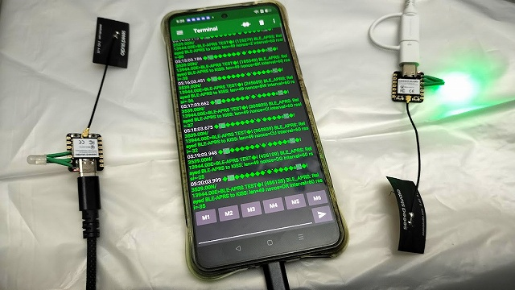
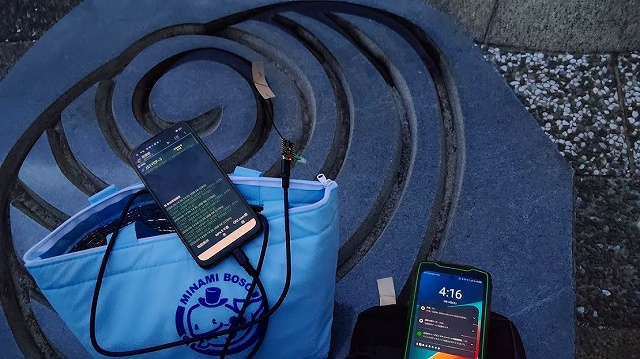
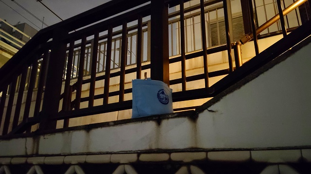
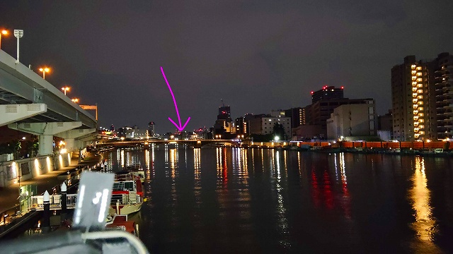
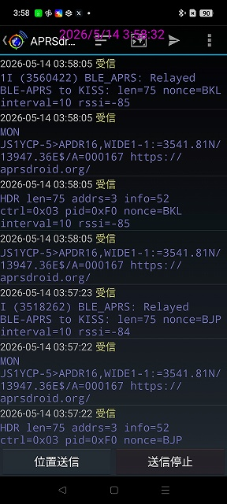
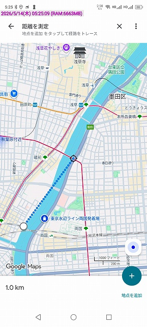

[開発メモ](/NOTE.md)

# BLE-APRS

# ⚠ Under development / 開発中 ⚠

このプロジェクトは実験的実装です。
仕様・パケット形式・動作・API・ビルド手順などは今後大きく変更される可能性があります。

現在は ESP32-C3 + ESP-IDF を使用した BLE Extended Advertising ベースの APRS 実験を目的としています。

---

# 概要

BLE Extended Advertising (LE Coded PHY) を利用して、APRS / AX.25 フレームを非接続型ブロードキャストで中継する実験プロジェクトです。

現在の実装では、KISS TNC 互換インターフェースを通じて APRSdroid 等と接続できます。

BLE payload 形式:

```text
$APRS,1,<relay_interval>,<nonce>>AX.25_FRAME
```

例:

```text
$APRS,1,60,A>AX.25...
```

* `relay_interval`

  * 中継要求間隔 (秒)
  * `0` は immediate relay request
* `nonce`

  * 重複抑制用
  * 同一 nonce は無視

---
<div style="display: flex; gap: 10px;">






</div>

---

# 現在の動作

* BLE 5 Extended Advertising
* LE Coded PHY
* KISS TNC input/output
* USB Serial/JTAG 対応
* APRS message packet の immediate relay
* relay_interval ベースのレート制御
* nonce ベースの重複抑制
* token bucket + temporary BAN によるフェイルセーフ

---

# NeoPixel LED

XIAO ESP32C3 D10 (GPIO10) の NeoPixel を使用。

| 色 | 動作                            |
| - | ----------------------------- |
| 赤 | BLE advertising               |
| 緑 | KISS frame received           |
| 青 | BLE-APRS received and relayed |

---

# 動作環境

現在確認している環境:

* XIAO ESP32C3
* ESP-IDF v5.4 系

---

# ビルド手順

## ESP-IDF 環境準備

ESP-IDF をセットアップしてください。

```bash
. $HOME/esp/esp-idf/export.sh
```

---

## clone

```bash
git clone https://github.com/YOURNAME/ble-aprs.git
cd ble-aprs
```

---

## menuconfig

```bash
idf.py menuconfig
```

主な設定:

* Bluetooth:

  * Bluedroid
  * BLE 5.0 enabled
  * Extended Advertising enabled
* Controller:

  * BLE Scan Duplicate disabled
  * TX Power
* USB Serial/JTAG enabled

---

## reconfigure

依存関係更新:

```bash
idf.py reconfigure
```

---

## build

```bash
idf.py build
```

---

## flash

```bash
idf.py flash
```

または:

```bash
idf.py -p /dev/ttyACM0 flash
```

---

## monitor

```bash
idf.py monitor
```

---

# WebSerial ESPTool を使う場合

ESP-IDF は複数 bin を書き込む必要があります。

通常は以下を使用:

```text
0x0000   build/bootloader/bootloader.bin
0x8000   build/partition_table/partition-table.bin
0x10000  build/ble-aprs.bin
```

または merge_bin を使用してください。

---

# ビルドトラブル時のクリーンアップ

## build ディレクトリ削除

```bash
rm -rf build
```

---

## managed_components 削除

```bash
rm -rf managed_components
```

---

## sdkconfig 初期化

```bash
rm sdkconfig
idf.py reconfigure
```

---

## 完全クリーン

```bash
rm -rf build managed_components
rm sdkconfig
idf.py reconfigure
idf.py build
```

---

# 現在の制限

* 実験コード
* 互換性未保証
* プロトコル仕様変更の可能性あり
* BLE airtime 最適化未実装
* digi/repeater 機能開発中

---

# ライセンス

MIT License

Copyright (c) 2026 Daisuke JA1UMW / CQAKIBA.TOKYO

Permission is hereby granted, free of charge, to any person obtaining a copy
of this software and associated documentation files (the "Software"), to deal
in the Software without restriction, including without limitation the rights
to use, copy, modify, merge, publish, distribute, sublicense, and/or sell
copies of the Software, and to permit persons to whom the Software is
furnished to do so, subject to the following conditions:

The above copyright notice and this permission notice shall be included in all
copies or substantial portions of the Software.

THE SOFTWARE IS PROVIDED "AS IS", WITHOUT WARRANTY OF ANY KIND, EXPRESS OR
IMPLIED, INCLUDING BUT NOT LIMITED TO THE WARRANTIES OF MERCHANTABILITY,
FITNESS FOR A PARTICULAR PURPOSE AND NONINFRINGEMENT. IN NO EVENT SHALL THE
AUTHORS OR COPYRIGHT HOLDERS BE LIABLE FOR ANY CLAIM, DAMAGES OR OTHER
LIABILITY, WHETHER IN AN ACTION OF CONTRACT, TORT OR OTHERWISE, ARISING FROM,
OUT OF OR IN CONNECTION WITH THE SOFTWARE OR THE USE OR OTHER DEALINGS IN THE
SOFTWARE.

